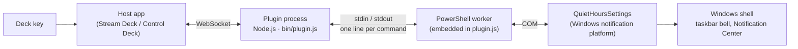

# How it works

This document explains what happens between pressing the key and Windows turning Do Not Disturb on, why it was built this way, and where its limits are.

## Overview



1. The **host app** (Elgato Stream Deck, Fifine Control Deck, StreamDock) starts the plugin with Node.js and talks to it over a local WebSocket. The plugin uses the official [`@elgato/streamdeck`](https://github.com/elgatosf/streamdeck) SDK, which StreamDock-based apps also understand.
2. The **plugin** (`src/`) keeps one **PowerShell worker** running in the background and sends it short text commands.
3. The **worker** calls `QuietHoursSettings`, an internal Windows COM object that manages Do Not Disturb profiles. Windows persists the new state and updates the taskbar and Notification Center immediately.

## Components

### Action: `src/actions/do-not-disturb.ts`

A `SingletonAction` registered for `com.mcristoni.windows-shortcuts.dnd`. It handles three things:

| Event | Behaviour |
| --- | --- |
| `willAppear` (key becomes visible) | Reads the current Windows state and sets the key image. Starts polling. |
| `keyDown` | Asks the worker to **toggle**, then sets the image of every visible key to the state Windows reports back. On failure, shows the host's alert icon. |
| Polling, every 2 seconds | Reads the state and updates the keys only if it changed. Stops when no key is visible. |

The manifest sets `"DisableAutomaticStates": true`. Without it, the host would flip the key image on every press by itself, on top of the plugin setting it, and the image could end up out of step with Windows.

The toggle is decided **by the worker from the real Windows state**, not from the key image. Even if the key were stale, pressing it always flips what Windows actually has.

### Worker client: `src/windows/do-not-disturb.ts`

Spawns and manages the PowerShell process:

- **One long-lived process.** Starting PowerShell and compiling the interop code costs a few hundred milliseconds. Paying that once at startup makes every later command take roughly 5–10 ms, which also makes 2-second polling cheap.
- **FIFO request queue.** The worker answers commands strictly in order, so each response line resolves the oldest pending request.
- **Self-healing.** If the process exits, errors, or a request takes longer than 15 seconds, all pending requests are rejected and the next command spawns a fresh worker.
- **No orphans.** When the plugin process exits, the worker's stdin closes, its read loop ends and PowerShell exits on its own.

### Worker: `src/windows/dnd-worker.ps1`

A PowerShell 5.1 script that compiles a tiny C# interop definition with `Add-Type`, prints `ready`, and then serves a line protocol.

The script is **not shipped as a file**. The build imports it as text into `bin/plugin.js`, and the plugin passes it to `powershell.exe -EncodedCommand`. Plugins distributed through the Elgato Marketplace are DRM-encrypted on disk, so the plugin must not depend on reading its own files at runtime; embedding the script avoids that, and also means PowerShell's script execution policy does not apply.

| Command (stdin) | Effect | Response (stdout) |
| --- | --- | --- |
| `get` | none | `on` or `off` |
| `on` | selects the *Priority only* profile | `on` |
| `off` | selects the *Unrestricted* profile | `off` |
| `toggle` | flips the current state | new state |
| anything else, or a Windows error | none | `error:<message>` |

The response to state-changing commands is read back from Windows after the change, not assumed.

## The Windows API

Windows models Do Not Disturb (called *Focus Assist* on Windows 10) as **quiet hours profiles**:

| Profile ID | Meaning |
| --- | --- |
| `Microsoft.QuietHoursProfile.Unrestricted` | Do Not Disturb off |
| `Microsoft.QuietHoursProfile.PriorityOnly` | Do Not Disturb on, priority notifications still allowed |
| `Microsoft.QuietHoursProfile.AlarmsOnly` | Alarms only (Focus Assist mode from Windows 10, still accepted on Windows 11) |

The worker uses the `QuietHoursSettings` COM class, which is registered by Windows but not publicly documented:

| | GUID |
| --- | --- |
| CLSID `QuietHoursSettings` | `f53321fa-34f8-4b7f-b9a3-361877cb94cf` |
| IID `IQuietHoursSettings` | `6bff4732-81ec-4ffb-ae67-b6c1bc29631f` |

Only the first two methods of the interface are declared and used:

```csharp
[ComImport, Guid("6bff4732-81ec-4ffb-ae67-b6c1bc29631f"), InterfaceType(ComInterfaceType.InterfaceIsIUnknown)]
public interface IQuietHoursSettings {
    [PreserveSig] int get_UserSelectedProfile([MarshalAs(UnmanagedType.LPWStr)] out string profileId);
    [PreserveSig] int put_UserSelectedProfile([MarshalAs(UnmanagedType.LPWStr)] string profileId);
}
```

Any profile other than `Unrestricted` is reported as "on". Unknown profile IDs are rejected with `E_INVALIDARG`. Writing a profile goes through the Windows notification platform, which stores it in the per-user CloudStore and notifies the shell, so the change is visible immediately.

## Why this approach

Several simpler-looking approaches were considered, and most were tried first. None works reliably on current Windows 11:

| Approach | Problem |
| --- | --- |
| Writing registry values | Windows keeps the state in a binary CloudStore blob and does not pick up direct registry edits for this setting. |
| Publishing WNF state changes through `ntdll` | The relevant WNF state names are protected; user processes get *access denied*. |
| UI Automation clicking the Notification Center button | Fragile, depends on UI language and layout, runs into UIPI restrictions and empty automation properties. |
| Sending keyboard shortcuts | Windows 11 has no default shortcut for Do Not Disturb. |

The COM class needs no elevation, applies instantly, and gives a real read-back of the state.

**Why PowerShell instead of a native Node module?** A native addon or FFI library would need prebuilt binaries for the Node version bundled by each host app (StreamDock-based apps ship their own Node 20). PowerShell 5.1 and the .NET Framework compiler are present on every Windows 10/11 install, so the plugin stays a single JavaScript bundle.

## Limitations

- **Undocumented interface.** `IQuietHoursSettings` is internal to Windows. A future Windows update could change or remove it; the plugin would then show the alert icon instead of toggling.
- **Automatic rules.** The plugin reads and writes the *user-selected* profile. Do Not Disturb activated automatically by Windows (scheduled hours, gaming, full-screen apps, display duplication) may not be reflected on the key.
- **Restricted PowerShell.** Machines that block PowerShell or enforce Constrained Language Mode prevent `Add-Type`, so the worker cannot start.
- **Windows only.** The manifest declares Windows 10+ only.

## Security and privacy

- No network access, telemetry or data collection.
- No administrator rights; everything runs as the signed-in user.
- The only process started is `powershell.exe`, running the worker script embedded in the plugin (via `-EncodedCommand`). No script files are written to disk, and no other scripts or downloaded code are executed.
- The only system change the plugin makes is selecting the Do Not Disturb profile, exactly as the Windows UI would.
